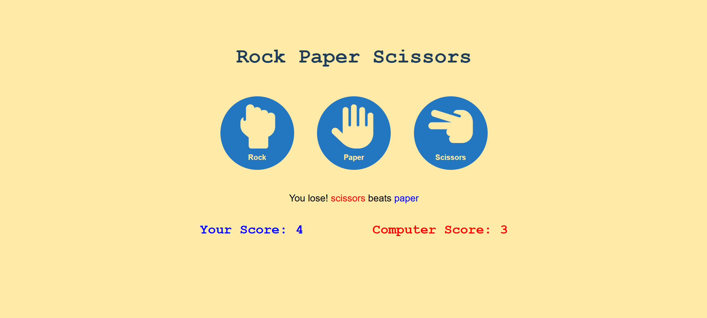

# Rock Paper Scissors Game

A simple implementation of the classic Rock Paper Scissors game using HTML, CSS, and JavaScript.

## 🔧 Features

- **Interactive Buttons**: Choose between Rock, Paper, or Scissors.
- **Scorekeeping**: Tracks the player's and computer's scores.
- **Responsive Design**: Works well on both desktop and mobile devices.
- **Game Logic**: Computer randomly picks one of the three choices and the winner is determined based on the rules.

## 🖥️ Tech Stack

- HTML
- CSS
- JavaScript

## 📸 Preview

